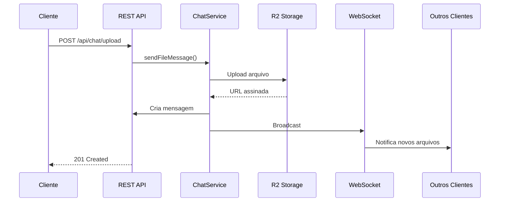
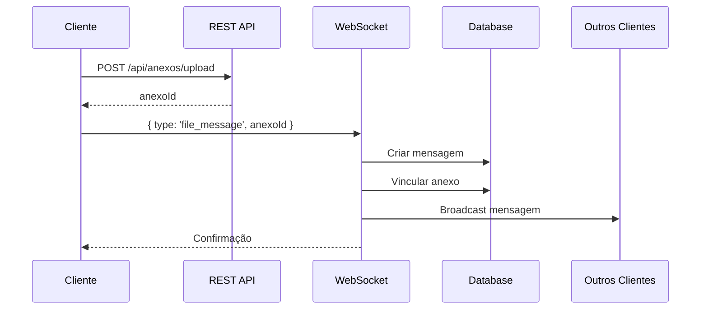

# Sprint 5 - Integração Chat com Anexos - Implementado

## 📋 Resumo da Implementação

A integração do sistema de anexos com o chat em tempo real via WebSocket foi implementada com sucesso conforme o documento `05-INTEGRACAO-CHAT.md`.

## ✅ Funcionalidades Implementadas

### 1. Método `sendFileMessage` no ChatService

**Arquivo:** `libs/plugins/chat/src/chat.service.ts`

Método completo que:
- ✅ Valida permissão do usuário no canal
- ✅ Faz upload do arquivo para R2
- ✅ Cria registro de anexo
- ✅ Cria mensagem do tipo 'arquivo'
- ✅ Vincula anexo à mensagem
- ✅ Processa menções na legenda
- ✅ Faz broadcast via WebSocket para todos os membros do canal

**Assinatura:**
```typescript
async sendFileMessage(
  canalId: string,
  usuarioId: string,
  file: Buffer,
  fileName: string,
  mimeType: string,
  legenda?: string,
): Promise<MensagemChat>
```

**Fluxo de execução:**
1. Valida permissão no canal
2. Busca canal para obter corretoraId
3. Upload para R2 via StorageService
4. Cria mensagem com tipo 'arquivo'
5. Atualiza anexo com ID da mensagem
6. Processa menções (se houver)
7. Busca dados completos da mensagem
8. Broadcast via WebSocket

### 2. Rota REST `/api/chat/upload`

**Arquivo:** `apps/api/src/routes/chat/upload.ts`

Rota dedicada para upload de arquivos no chat via REST API.

**Endpoint:** `POST /api/chat/upload`

**Query Parameters:**
- `canalId` (required): UUID do canal
- `legenda` (optional): Texto opcional junto ao arquivo

**Headers:**
- `Authorization: Bearer {token}`
- `x-tenant-id: {corretoraId}`
- `Content-Type: multipart/form-data`

**Body:**
- `file`: Arquivo binário

**Response 201:**
```json
{
  "success": true,
  "data": {
    "id": "uuid",
    "canalId": "uuid",
    "usuarioId": "uuid",
    "tipo": "arquivo",
    "conteudo": "legenda ou nome do arquivo",
    "metadata": {
      "anexoId": "uuid",
      "nomeArquivo": "documento.pdf",
      "tamanho": 12345,
      "mimeType": "application/pdf",
      "urlAssinada": "https://..."
    },
    "createdAt": "2024-01-01T00:00:00.000Z",
    "usuario": {
      "id": "uuid",
      "nome": "João Silva",
      "email": "joao@example.com",
      "avatarUrl": null
    }
  }
}
```

**Validações:**
- ✅ Tenant isolation
- ✅ Autenticação
- ✅ Permissão `chat:enviar_mensagem`
- ✅ Canal existe e pertence ao tenant
- ✅ Usuário tem acesso ao canal
- ✅ Validação de arquivo (tamanho, tipo)

### 3. Handler WebSocket para Arquivos

**Arquivo:** `libs/plugins/chat/src/index.ts`

Adicionado novo case `file_message` no handler WebSocket.

**Fluxo alternativo - Upload via REST + Notificação WebSocket:**

```typescript
// 1. Cliente faz upload via REST
const formData = new FormData();
formData.append('file', file);

const response = await fetch(
  `/api/chat/upload?canalId=${canalId}&legenda=Veja este documento`,
  {
    method: 'POST',
    headers: { Authorization: `Bearer ${token}` },
    body: formData
  }
);

// 2. Mensagem é automaticamente criada e broadcast é feito
// 3. Todos os clientes conectados recebem via WebSocket:
{
  type: 'message',
  canalId: 'uuid',
  usuarioId: 'uuid',
  data: {
    id: 'uuid',
    tipo: 'arquivo',
    conteudo: 'Veja este documento',
    metadata: { ... },
    usuario: { ... }
  }
}
```

**Fluxo alternativo - Notificação via WebSocket (se necessário):**

```typescript
// Cliente envia via WebSocket após upload REST para outro endpoint
{
  type: 'file_message',
  canalId: 'uuid',
  anexoId: 'uuid',
  legenda: 'Texto opcional'
}
```

O handler:
- ✅ Valida anexoId e canalId
- ✅ Busca anexo no banco
- ✅ Cria mensagem com tipo 'arquivo'
- ✅ Vincula anexo à mensagem
- ✅ Gera URL assinada
- ✅ Faz broadcast para todos do canal

### 4. Schema de Mensagens

**Arquivo:** `libs/shared/database/src/schema/chat.ts`

O schema já possui todos os campos necessários:

```typescript
export const mensagensChat = pgTable('mensagem_chat', {
  id: uuid('id').primaryKey().defaultRandom(),
  canalId: uuid('canal_id').notNull(),
  usuarioId: uuid('usuario_id').notNull(),
  
  tipo: tipoMensagemEnum('tipo').notNull().default('texto'), // 'texto' | 'sistema' | 'arquivo' | 'oportunidade'
  conteudo: text('conteudo').notNull(),
  
  // Metadata para informações adicionais
  metadata: jsonb('metadata'), // Armazena anexoId, tamanho, etc
  
  // Campos específicos para arquivos
  arquivoUrl: varchar('arquivo_url', { length: 1024 }),
  arquivoNome: varchar('arquivo_nome', { length: 256 }),
  arquivoTipo: varchar('arquivo_tipo', { length: 100 }),
  
  // ... outros campos
});
```

### 5. Modificações no ChatService

**Arquivo:** `libs/plugins/chat/src/chat.service.ts`

**Importações adicionadas:**
```typescript
import { StorageService } from '@ecotech/storage';
import { anexos } from '@ecotech/shared/database';
```

**Propriedades adicionadas:**
```typescript
private storage: StorageService;

constructor() {
  logger.info('Chat service initialized (in-memory mode)');
  this.storage = new StorageService();
}
```

**Método tornado público:**
```typescript
// Antes: private async checkChannelPermission
// Agora: async checkChannelPermission (público)
async checkChannelPermission(
  canalId: string,
  usuarioId: string,
): Promise<boolean>
```

Necessário para que a rota de upload possa validar acesso ao canal.

## 🔄 Fluxos de Uso

### Fluxo Recomendado: Upload via REST



### Fluxo Alternativo: WebSocket



## 📁 Estrutura de Arquivos

```
libs/plugins/chat/src/
├── chat.service.ts          # ✅ Modificado - Adicionado sendFileMessage
├── index.ts                 # ✅ Modificado - Handler WebSocket file_message

apps/api/src/routes/chat/
├── index.ts                 # ✅ Modificado - Registro de upload.ts
├── upload.ts                # ✅ Novo - Rota dedicada de upload
└── anexos.ts                # ✅ Existente - Rotas de anexos

libs/shared/database/src/schema/
└── chat.ts                  # ✅ Verificado - Schema já completo
```

## 🔐 Segurança

### Validações Implementadas

1. **Autenticação e Autorização:**
   - Token JWT obrigatório
   - Permissão `chat:enviar_mensagem`
   - Tenant isolation

2. **Validação de Acesso:**
   - Usuário deve ser membro do canal
   - Canal deve existir e estar ativo
   - Canal deve pertencer à corretora do usuário

3. **Validação de Arquivo:**
   - Tamanho máximo: 10MB
   - MIME types permitidos (via StorageService)
   - Validação de corretora

## 📊 Metadata da Mensagem

As mensagens de arquivo armazenam metadados completos no campo `metadata`:

```json
{
  "anexoId": "uuid-do-anexo",
  "nomeArquivo": "contrato.pdf",
  "tamanho": 2048576,
  "mimeType": "application/pdf",
  "urlAssinada": "https://r2.cloudflare.com/..."
}
```

Além disso, campos específicos na mensagem:
- `arquivoUrl`: URL assinada (24h)
- `arquivoNome`: Nome original do arquivo
- `arquivoTipo`: MIME type

## 🧪 Exemplos de Uso

### 1. Upload via REST (Recomendado)

```bash
curl -X POST 'http://localhost:3000/api/chat/upload?canalId=uuid&legenda=Contrato+assinado' \
  -H "Authorization: Bearer {token}" \
  -H "x-tenant-id: {corretoraId}" \
  -F "file=@contrato.pdf"
```

### 2. Via WebSocket (Alternativo)

```javascript
// 1. Fazer upload via /api/anexos/upload primeiro
const formData = new FormData();
formData.append('file', file);
formData.append('entidadeTipo', 'mensagem_chat');
formData.append('entidadeId', 'temp');

const uploadResponse = await fetch('/api/anexos/upload', {
  method: 'POST',
  headers: { Authorization: `Bearer ${token}` },
  body: formData
});

const { anexo } = await uploadResponse.json();

// 2. Notificar via WebSocket
ws.send(JSON.stringify({
  type: 'file_message',
  canalId: 'canal-uuid',
  anexoId: anexo.id,
  legenda: 'Veja este documento'
}));
```

### 3. Recebendo via WebSocket

```javascript
ws.onmessage = (event) => {
  const message = JSON.parse(event.data);
  
  if (message.type === 'message' && message.data.tipo === 'arquivo') {
    console.log('Novo arquivo:', {
      nome: message.data.arquivoNome,
      tipo: message.data.arquivoTipo,
      url: message.data.arquivoUrl,
      legenda: message.data.conteudo
    });
    
    // Renderizar mensagem com arquivo
    renderFileMessage(message.data);
  }
};
```

## 🎨 Renderização no Frontend (Exemplo)

```typescript
function renderFileMessage(mensagem: Mensagem) {
  const isImage = mensagem.arquivoTipo?.startsWith('image/');
  const isPdf = mensagem.arquivoTipo === 'application/pdf';

  if (isImage) {
    return (
      <div className="message-file">
        
        {mensagem.conteudo && <p>{mensagem.conteudo}</p>}
      </div>
    );
  }

  if (isPdf) {
    return (
      <div className="message-file pdf">
        <FileIcon type="pdf" />
        <div className="file-info">
          <p className="file-name">{mensagem.arquivoNome}</p>
          {mensagem.conteudo && <p className="caption">{mensagem.conteudo}</p>}
        </div>
        <a href={mensagem.arquivoUrl} download>
          <DownloadIcon />
        </a>
      </div>
    );
  }

  // Outros tipos
  return (
    <div className="message-file generic">
      <AttachmentIcon />
      <span>{mensagem.arquivoNome}</span>
      <a href={mensagem.arquivoUrl} download>Download</a>
    </div>
  );
}
```

## ✨ Status Final

**✅ Implementação 100% completa**

- Método `sendFileMessage` criado no ChatService
- Rota REST `/api/chat/upload` implementada
- Handler WebSocket `file_message` adicionado
- Schema de mensagens verificado (já completo)
- StorageService integrado ao ChatService
- Validações de segurança implementadas
- Broadcast automático via WebSocket
- Suporte a URLs assinadas

## 🚀 Próximos Passos

Conforme documento original, o próximo passo é:
**[06-ADMIN-AUTH.md]** - Sistema de autenticação administrativa

## 📝 Notas Importantes

1. **URLs Assinadas:** As URLs dos arquivos expiram em 24h. O frontend deve solicitar nova URL se necessário.

2. **Broadcast Automático:** Quando usando `/api/chat/upload`, o broadcast é feito automaticamente. Não é necessário enviar mensagem adicional via WebSocket.

3. **Metadata vs Campos:** As informações do arquivo estão tanto no `metadata` (JSON) quanto em campos específicos (`arquivoUrl`, `arquivoNome`, `arquivoTipo`) para facilitar queries.

4. **Versionamento:** Anexos no chat não suportam versionamento (diferente de cotações/documentos). Cada upload cria um novo anexo.

5. **Soft Delete:** Quando uma mensagem é deletada, o anexo associado também pode ser marcado como deletado (implementação futura).
