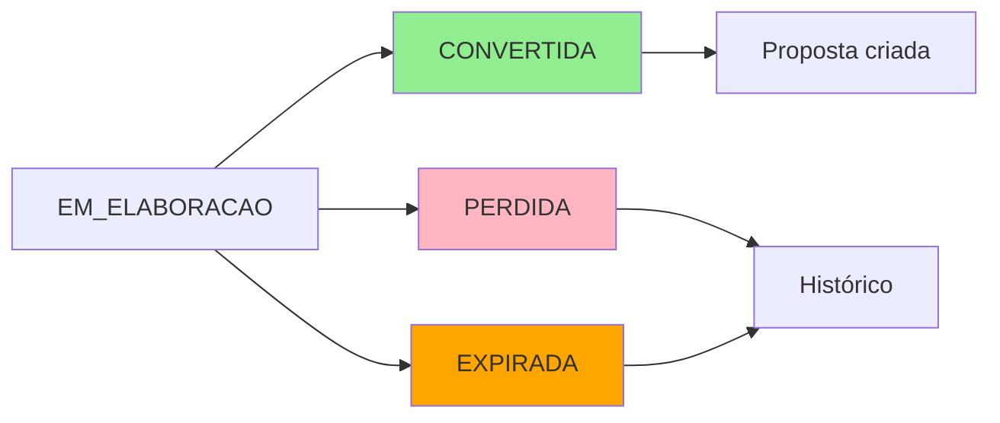
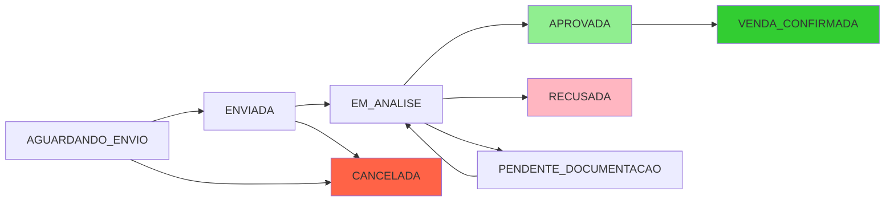
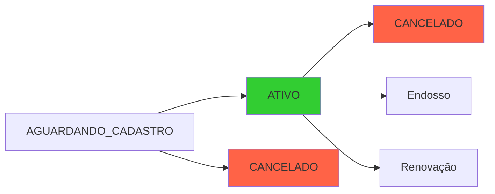
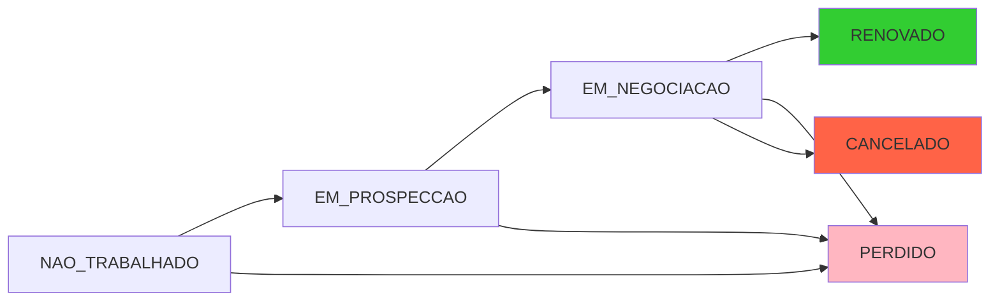

# 🔄 Análise de Transições de Status

**Data**: 2026-01-06  
**Escopo**: Fluxos de status de Cotações, Propostas, Documentos de Venda e Renovações

---

## 📊 MAPEAMENTO DE STATUS ATUAL

### Status de Cotação
```typescript
enum StatusCotacao {
  EM_ELABORACAO    // 📝 Cotação sendo criada/editada
  PERDIDA          // ❌ Cliente não fechou
  EXPIRADA         // ⏰ Prazo de validade venceu
  CONVERTIDA       // ✅ Virou proposta ou venda
}
```

### Status de Proposta
```typescript
enum StatusProposta {
  AGUARDANDO_ENVIO      // 📋 Proposta criada, ainda não enviada
  ENVIADA               // 📤 Enviada para seguradora
  EM_ANALISE            // 🔍 Seguradora analisando
  PENDENTE_DOCUMENTACAO // 📄 Faltam documentos
  APROVADA              // ✅ Seguradora aprovou
  APROVADA_CONDICIONAL  // ⚠️ Aprovada com ressalvas
  RECUSADA              // ❌ Seguradora recusou
  CANCELADA             // 🚫 Cancelada pelo corretor/cliente
  VENDA_CONFIRMADA      // 💰 Venda confirmada, vai para cadastro
}
```

### Status de Documento de Venda
```typescript
enum StatusDocumentoVenda {
  EM_NEGOCIACAO         // 💬 Em negociação com cliente
  AGUARDANDO_CLIENTE    // ⏳ Aguardando resposta do cliente
  AGUARDANDO_APROVACAO  // 🔒 Aguardando aprovação interna
  VENDA_CONFIRMADA      // ✅ Venda confirmada
  AGUARDANDO_CADASTRO   // 📝 Aguardando setor de cadastro processar
  ATIVO                 // 🟢 Apólice ativa
  CANCELADO             // 🔴 Cancelado
  PERDIDO               // ❌ Negócio perdido
}
```

### Status de Renovação
```typescript
enum StatusRenovacao {
  NAO_TRABALHADO        // 🆕 Ainda não iniciada
  EM_PROSPECCAO         // 🔍 Prospectando renovação
  EM_NEGOCIACAO         // 💬 Negociando valores
  AGUARDANDO_CLIENTE    // ⏳ Aguardando cliente
  RENOVADO              // ✅ Renovação concluída
  PERDIDO               // ❌ Cliente não renovou
  CANCELADO             // 🚫 Cancelado
}
```

### Status de Endosso
```typescript
enum StatusEndosso {
  SOLICITADO            // 📋 Endosso solicitado
  EM_VALIDACAO          // 🔍 Validando documentos
  APROVADO              // ✅ Aprovado pela seguradora
  RECUSADO              // ❌ Recusado
  EMITIDO               // 📄 Endosso emitido
  CANCELADO             // 🚫 Cancelado
}
```

---

## 🔴 PROBLEMAS IDENTIFICADOS

### 1. Cotações "PERDIDA" ainda aparecem em Renovações Pendentes

**Comportamento Atual**: ❌
- Cotação marcada como PERDIDA continua visível em "Renovações Pendentes"
- Polui a área de trabalho com negócios que não vão acontecer

**Comportamento Esperado**: ✅
- Cotação PERDIDA deve sair de "Renovações Pendentes"
- Deve ir para histórico no perfil do cliente
- Deve aparecer em relatório de cotações perdidas

**Arquivo Afetado**:
```typescript
// apps/web/src/lib/queries/area-trabalho.ts
export function useRenovacoesPendentes() {
  return useQuery({
    queryFn: async () => {
      const response = await api.get('/renovacoes/pendentes');
      // ⚠️ Não filtra renovações com cotação PERDIDA
      return renovacoes.map((renovacao: any) => {
        // Mapeia dados...
      });
    }
  });
}
```

**Solução**:
```typescript
// Backend: GET /renovacoes/pendentes
// Filtrar apenas renovações ativas
WHERE status IN ('NAO_TRABALHADO', 'EM_PROSPECCAO', 'EM_NEGOCIACAO', 'AGUARDANDO_CLIENTE')
// Excluir: PERDIDO, CANCELADO, RENOVADO

// Ou verificar se cotação relacionada não está PERDIDA
AND (cotacaoId IS NULL OR cotacao.status != 'PERDIDA')
```

---

### 2. Documentos "CANCELADO" sem fluxo definido

**Problema**:
- Status `CANCELADO` existe mas não há fluxo claro
- Não há botão/ação para cancelar documento de venda
- Não está claro se vai para histórico ou fica visível

**Recomendação**:
1. **Adicionar ação "Cancelar"** em documentos ativos
2. **Pedir motivo do cancelamento** (dropdown + textarea)
3. **Mover para histórico** após cancelamento
4. **Registrar no histórico de eventos**

**Implementação Sugerida**:
```typescript
// Frontend: Botão de cancelar
<Button 
  variant="destructive"
  onClick={() => handleCancelarDocumento(documento)}
>
  Cancelar Documento
</Button>

// Dialog de confirmação com motivo
interface CancelarDocumentoForm {
  motivo: 'CLIENTE_DESISTIU' | 'ERRO_CADASTRO' | 'DUPLICADO' | 'OUTRO';
  observacoes?: string;
}

// Backend: POST /documentos-venda/:id/cancelar
async cancelarDocumento(id: string, data: CancelarDocumentoForm) {
  await prisma.documentoVenda.update({
    where: { id },
    data: { 
      status: 'CANCELADO',
      motivoCancelamento: data.motivo,
      observacoesCancelamento: data.observacoes,
      dataCancel: new Date(),
    }
  });
  
  // Registrar no histórico
  await prisma.historicoDocumento.create({
    data: {
      documentoVendaId: id,
      tipoEvento: 'CANCELAMENTO',
      descricao: `Documento cancelado. Motivo: ${data.motivo}`,
    }
  });
}
```

---

### 3. Endossos não aparecem na área de trabalho

**Problema**:
- Sistema tem tabela/modelo de Endosso
- Não há seção para endossos na área de trabalho
- Endossos criados ficam "invisíveis"

**Recomendação**:
1. **Adicionar aba "Endossos"** na área de trabalho
2. **Listar endossos pendentes** (SOLICITADO, EM_VALIDACAO)
3. **Permitir criar endosso** a partir de documento ativo
4. **Fluxo**: Criar → Validar → Aprovar → Emitir

**Implementação Sugerida**:
```typescript
// Nova aba em workspace/page.tsx
<TabsTrigger value="endossos">
  Endossos Pendentes ({endossos.length})
</TabsTrigger>

<TabsContent value="endossos">
  <EndossosPendentesTable 
    endossos={endossos}
    onVisualizar={handleVisualizarEndosso}
    onEmitir={handleEmitirEndosso}
  />
</TabsContent>

// Query para listar endossos
export function useEndossosPendentes() {
  return useQuery({
    queryKey: ['endossos', 'pendentes'],
    queryFn: async () => {
      return api.get('/endossos', {
        status: 'SOLICITADO,EM_VALIDACAO,APROVADO'
      });
    }
  });
}
```

---

## 🎯 FLUXOS RECOMENDADOS

### Fluxo de Cotação



**Regras**:
- `EM_ELABORACAO → CONVERTIDA`: Quando converter para proposta/venda
- `EM_ELABORACAO → PERDIDA`: Quando cliente não fecha negócio
- `EM_ELABORACAO → EXPIRADA`: Quando `dataValidade < hoje` (automático)
- `PERDIDA/EXPIRADA`: Remove de "Renovações Pendentes", vai para histórico

---

### Fluxo de Proposta



**Regras**:
- `APROVADA → VENDA_CONFIRMADA`: Quando confirmar venda
- `VENDA_CONFIRMADA`: Cria documento de venda com status `AGUARDANDO_CADASTRO`
- `RECUSADA/CANCELADA`: Remove de "Propostas Ativas", vai para histórico

---

### Fluxo de Documento de Venda



**Regras**:
- `AGUARDANDO_CADASTRO → ATIVO`: Setor de cadastro processa e emite apólice
- `ATIVO`: Documento ativo, gera renovação automática 60 dias antes
- `ATIVO → CANCELADO`: Cancelamento manual com motivo
- `CANCELADO/PERDIDO`: Vai para histórico, não gera renovação

---

### Fluxo de Renovação



**Regras**:
- `NAO_TRABALHADO → EM_PROSPECCAO`: Vendedor inicia contato
- `EM_NEGOCIACAO → RENOVADO`: Cria nova cotação/venda
- `PERDIDO/CANCELADO`: Remove de "Renovações Pendentes"
- Renovações aparecem 60 dias antes do vencimento

---

## 🛠️ IMPLEMENTAÇÃO RECOMENDADA

### 1. Filtrar Renovações Pendentes (Alta Prioridade)

**Backend**:
```typescript
// apps/api/src/routes/renovacoes/index.ts
router.get('/pendentes', async (req, res) => {
  const renovacoes = await prisma.renovacao.findMany({
    where: {
      seguradoraId: req.seguradoraId,
      status: {
        in: ['NAO_TRABALHADO', 'EM_PROSPECCAO', 'EM_NEGOCIACAO', 'AGUARDANDO_CLIENTE']
      },
      // Excluir renovações com cotação perdida
      OR: [
        { cotacaoId: null },
        { cotacao: { status: { not: 'PERDIDA' } } }
      ]
    },
    include: {
      documentoVendaAnterior: {
        include: { cliente: true, produto: true }
      },
      cotacao: true,
    },
    orderBy: { dataVencimento: 'asc' }
  });
  
  res.json(renovacoes);
});
```

**Frontend**: Já está correto, apenas precisa do backend atualizado.

---

### 2. Implementar Ação de Cancelamento (Média Prioridade)

**Componentes Necessários**:
1. `CancelarDocumentoDialog` - Dialog para pedir motivo
2. Mutation `useCancelarDocumento`
3. Botão "Cancelar" em documentos ativos

**Código Sugerido**:
```typescript
// apps/web/src/lib/queries/documentos-venda.ts
export function useCancelarDocumento() {
  const queryClient = useQueryClient();
  
  return useMutation({
    mutationFn: async ({ id, motivo, observacoes }: {
      id: string;
      motivo: string;
      observacoes?: string;
    }) => {
      return api.post(`/documentos-venda/${id}/cancelar`, {
        motivo,
        observacoes
      });
    },
    onSuccess: () => {
      queryClient.invalidateQueries({ queryKey: ['documentos-venda'] });
      toast.success('Documento cancelado com sucesso');
    }
  });
}
```

---

### 3. Adicionar Seção de Endossos (Baixa Prioridade)

**Estrutura**:
```
apps/web/src/components/endossos/
  ├── endossos-pendentes-table.tsx
  ├── endosso-dialog.tsx
  ├── criar-endosso-dialog.tsx
  └── endosso-details-card.tsx
```

**Query**:
```typescript
export function useEndossosPendentes() {
  return useQuery({
    queryKey: ['endossos', 'pendentes'],
    queryFn: async () => {
      return api.get('/endossos', {
        status: 'SOLICITADO,EM_VALIDACAO,APROVADO'
      });
    }
  });
}
```

---

### 4. Remover "Vendas e Renovações próximos 45 dias" (Opcional)

**Análise**:
- ✅ **Manter**: Se equipe usa para planejamento de renovações
- ❌ **Remover**: Se causa confusão e duplica informações

**Alternativa**:
- Transformar em aba separada "Planejamento"
- Ou mover para dashboard principal

**Código para Remover**:
```typescript
// apps/web/src/app/(app)/workspace/page.tsx
// Remover linhas ~280-450 (seção "Vendas Ativas e Renovações")

// Remover queries relacionadas:
const { data: vendasWorkspace } = useVendasWorkspace(); // ❌ Deletar
```

---

## 📋 CHECKLIST DE IMPLEMENTAÇÃO

### Fase 1: Correções Críticas
- [ ] Backend: Filtrar renovações por status ativo
- [ ] Backend: Excluir renovações com cotação PERDIDA
- [ ] Frontend: Validar que lista de renovações está correta
- [ ] Testar: Marcar cotação como perdida e verificar se sai da lista

### Fase 2: Cancelamentos
- [ ] Backend: Endpoint POST `/documentos-venda/:id/cancelar`
- [ ] Backend: Adicionar campos `motivoCancelamento`, `observacoesCancelamento`
- [ ] Frontend: Criar `CancelarDocumentoDialog`
- [ ] Frontend: Adicionar botão "Cancelar" em documentos ativos
- [ ] Testar: Cancelar documento e verificar histórico

### Fase 3: Endossos (Opcional)
- [ ] Backend: Endpoint GET `/endossos` com filtros
- [ ] Backend: Endpoint POST `/endossos/:id/emitir`
- [ ] Frontend: Criar componentes de endosso
- [ ] Frontend: Adicionar aba "Endossos" no workspace
- [ ] Testar: Criar e emitir endosso

### Fase 4: Refatoração Dashboard
- [ ] Avaliar com equipe se manter/remover seção 45 dias
- [ ] Se remover: Deletar código e queries relacionadas
- [ ] Se manter: Transformar em aba separada
- [ ] Atualizar documentação de uso

---

## 📊 IMPACTO DAS MUDANÇAS

| Mudança | Impacto | Esforço | Prioridade |
|---------|---------|---------|------------|
| Filtrar renovações ativas | 🟢 Alto | 🟡 Baixo | 🔴 Alta |
| Implementar cancelamento | 🟢 Médio | 🟡 Médio | 🟡 Média |
| Adicionar endossos | 🟡 Baixo | 🔴 Alto | 🟢 Baixa |
| Refatorar dashboard | 🟡 Baixo | 🟢 Baixo | 🟢 Baixa |

---

## 🎓 BOAS PRÁTICAS APLICADAS

1. **Estados Finitos**: Status bem definidos com transições claras
2. **Histórico**: Todos os eventos registrados para auditoria
3. **Separação de Concerns**: Cada entidade tem seus próprios status
4. **User Feedback**: Sempre mostrar toast após ações
5. **Validação**: Backend valida transições de status permitidas

---

**Próximos Passos**: Implementar correções da Fase 1 (Prioridade Alta)
